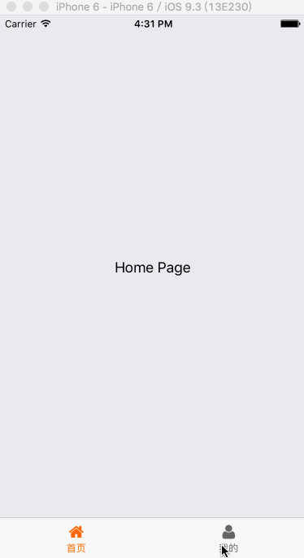

# kn-react-native-router

A react-native routing navigator...

## Screenshots



## Installation

```bash
npm i --save kn-react-native-router
```

## Usage

```bash
'use strict';

import React, { Component } from 'react'
import { StyleSheet, View, Text } from 'react-native'
import Icon from 'react-native-vector-icons/FontAwesome'

import {
  Router,
  Route,
  TabRoute
} from 'kn-react-native-router'
import {
  HomeNavigator,
  UserNavigator,
  SearchNavigator,
  LoginNavigator
} from '../features'

export default class Application extends Component {
  render () {
    return (
      <Router {...this.props}>
        <Route name={'search'}
               component={SearchNavigator}
               />
        <Route name={'login'}
               component={LoginNavigator}
               />
        <TabRoute>
          <Route name={'home'} 
                 title={'首页'}
                 icon={() => <Icon name={'home'} size={20} color={'#666'} />}
                 selectIcon={() => <Icon name={'home'} size={20} color={'#f60'} />} 
                 component={HomeNavigator}
                 />
          <Route name={'user'} 
                 title={'我的'}
                 icon={() => <Icon name={'user'} size={20} color={'#666'} />}
                 selectIcon={() => <Icon name={'user'} size={20} color={'#f60'} />} 
                 component={UserNavigator}
                 />
        </TabRoute>
      </Router>
    )
  }
}
```

* [Demo](./example/KNRouter)

## React-Native Modules In Using

* [react-native-root-toast](https://github.com/magicismight/react-native-root-toast)
* [react-native-tab-navigator](https://github.com/exponentjs/react-native-tab-navigator)

## License

[MIT License](http://en.wikipedia.org/wiki/MIT_License)